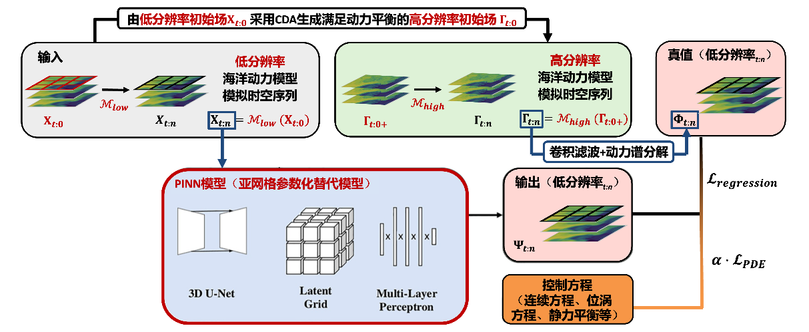
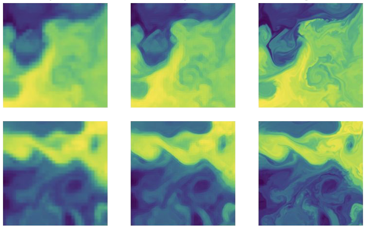

# OceanPINN
### [Project Page]() | [Video]() | [Paper]() | [Data]()
[OceanPINN: a physics-informed neural network for downscaling 3D fliud flow]
 [Peng Zhan]()\*<sup>1</sup>,
 [Gan Liu](https://github.com/GanLiuuuu)\*<sup>1</sup>,
 [Jianuo Zhu]()\*<sup>1</sup> <br>
 <sup>1</sup>SUSTech, <sup>2</sup>KAUST
  \*denotes equal contribution  
<br><br>



## Quickstart

To setup a conda environment, download example training data, begin the training process, and launch Tensorboard:
```
conda env create -f environment.yml
conda activate oceanpinn
bash download_example_data.sh
python run_pinn.py --config config.txt
```


## Setup

Python 3 dependencies:

* Tensorflow 1.15
* matplotlib
* numpy
* ...
* ...
* ...


We provide a conda environment setup file including all of the above dependencies. Create the conda environment `oceanpinn` by running:
```
conda env create -f environment.yml
```


## What is a OceanPINN?
Using Physics-Informed Neural Networks (PINN) technology, efficient downscaling processing of the RB flow field is achieved, extending from a two-dimensional scenario to a more complex three-dimensional situation. By simulating under physical constraints, high-resolution inversion of the density and flow velocity of three-dimensional fluids is performed. This method is expected to significantly improve the analytical accuracy of fluid dynamics characteristics, thereby promoting a deeper understanding of the underlying mechanisms of fluid dynamics.<br>



